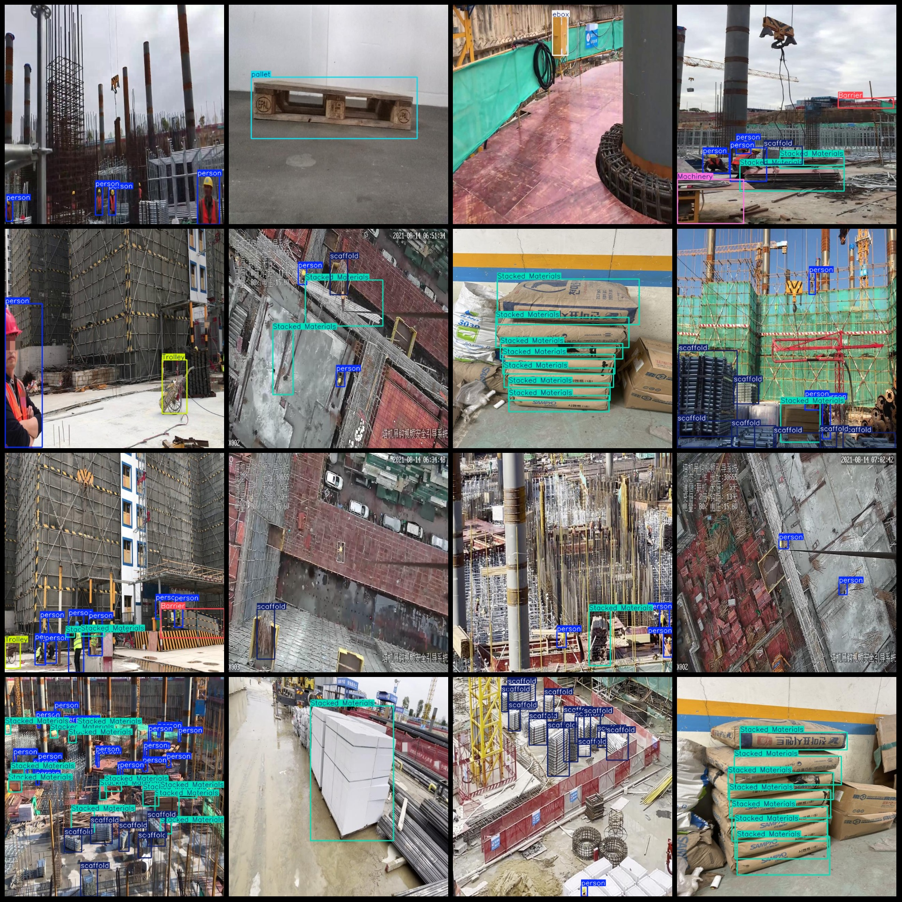
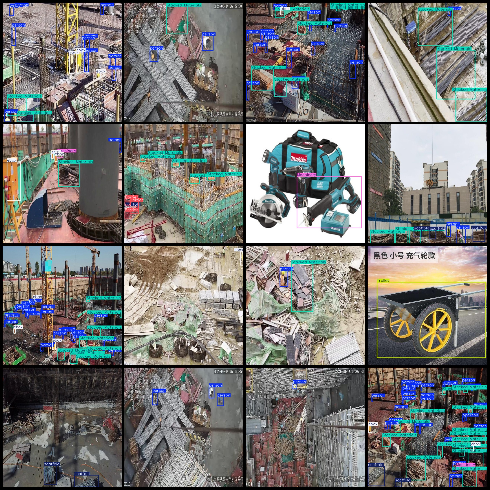

# Smart Construction Dataset: Object and Facilities Detection in Construction Sites or Industrial Venues - VOC+YOLO Format - 19,704 Images - 14 Categories

dataset format: Pascal VOC format+YOLO format
number of images: 19704  
annotation count: 19704  
annotation count: 19704  
annotationnumber of classes: 14  
Annotation class names: ["Barrier", "Machinery", "Mounted Sockets", "Stacked Materials", "Trolley", "door", "ebox", "fire exit", "forklift", "lift", "pallet", "person", "scaffold", "water-tank"]
boxes per class:   
Barrier box count = 8832
Machinery box count = 2000
Mounted Sockets box count = 150
Stacked Materials box count = 39748
Trolley box count = 1374
door box count = 99
ebox box count = 8105
fire exit box count = 66
forklift box count = 274
lift box count = 22
pallet box count = 524
person box count = 71020
scaffold box count = 24749
water-tank box count = 30
total boxes: 156993  
Application Area: Common objects and facilities in construction sites or industrial places for class detection and recognition.
image resolution: 640x640  
Use the annotation tool: labelImg
Annotation rules: draw a rectangle around the class
Important notes: There are no special statements at this time.
Special statement: This dataset does not guarantee the accuracy of the trained model or weight file.
Image preview:
## Images

Here is a pay link on Stripe ( https://buy.stripe.com/3cs8yP7sY87d0vu9AB ). Please contact me lonlonago@foxmail.com after funding $89, and I will send you a complete data files , thank you!

